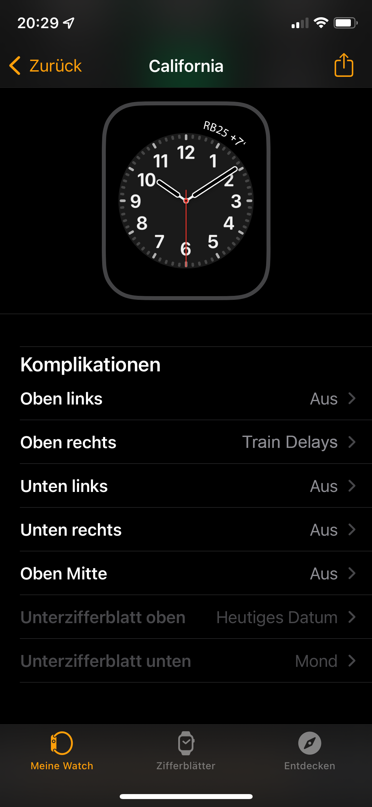

# Product Vision

The Train Delays Complication for Apple Watch shows the current delay of your favourite train in minutes.

Configure the complication using the associated iPhone App:

- Train to monitor
- Direction of the train
- Station for which you want to see delay of the next scheduled train

The following screenshot shows that the next train with number "RB25" is expected to be delayed by 7 minutes.

